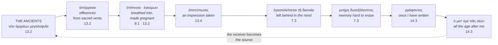
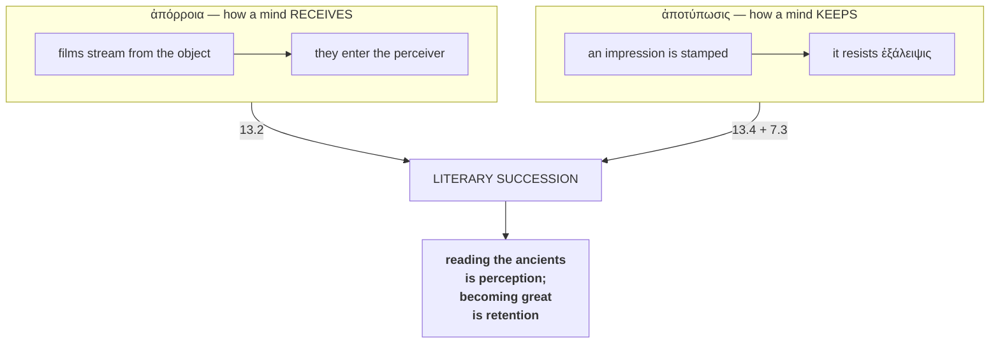
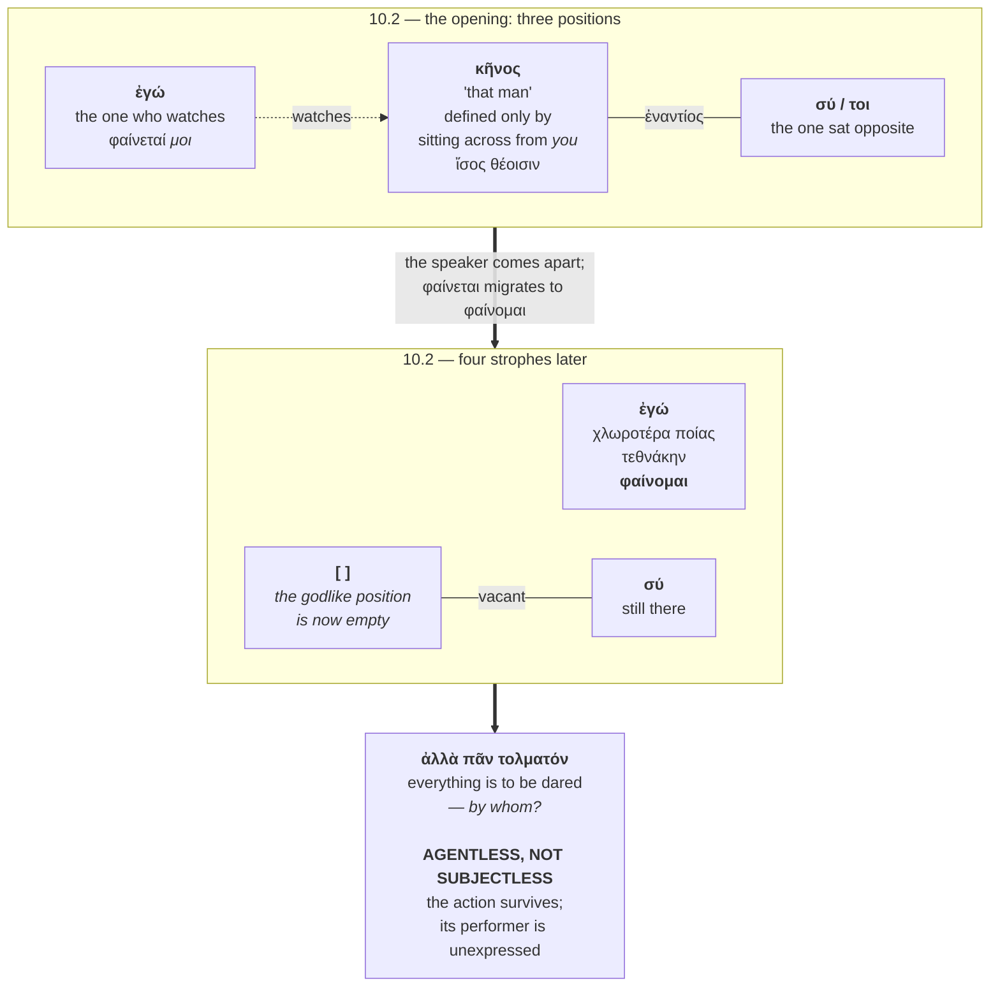
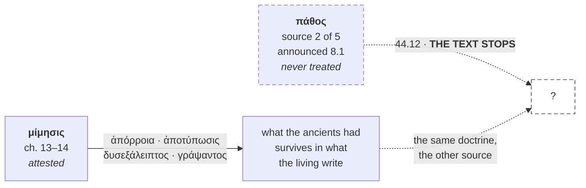

# The Echo and the Stamp: Peri Hypsous as a Theory of Transmissional Inscription, with a Constrained Reconstruction of Its Lost Ending


## Files

data/texts/AXN-<HEX>-text.md

# THE ECHO AND THE STAMP

***Peri Hypsous* as a theory of transmissional inscription,
with a constrained reconstruction of its lost ending**

> ὕψος μεγαλοφροσύνης **ἀπήχημα**.
>
> *Sublimity is the echo of greatness of soul.* — 9.2
An echo is not a sound. It is a sound's **return** from a surface, after the sounding has stopped. Longinus defines the highest thing in literature as a reverberation, and then gives, as his supreme instance of it, **a silence**:

> φωνῆς δίχα θαυμάζεταί ποτε ψιλὴ καθ᾽ ἑαυτὴν ἡ ἔννοια δι᾽ αὐτὸ τὸ μεγαλόφρον, ὡς ἡ τοῦ Αἴαντος ἐν Νεκυίᾳ **σιωπὴ μέγα καὶ παντὸς ὑψηλότερον λόγου**.
>
> *Even **without voice** the bare thought alone is sometimes admired for its greatness — as **Ajax's silence in the underworld is great, and higher than any speech**.*
The peak of the sublime, in the treatise that names it, is a dead man who says nothing and is heard anyway.

This document argues that this is not a paradox but the treatise's thesis. *Peri Hypsous* is a theory of how greatness crosses from the dead to the living and from the living to the unborn; its mechanism is stated twice in the technical vocabulary of ancient physics; its criterion is resistance to erasure; and it breaks off in the middle of returning to the one source it never treated.

**The sublime is what survives the removal of the voice. That is a definition of writing.**

---

## I. THE CIRCUIT

Every term in what follows is Longinus's own, and they form a closed loop.



Read it once as a whole and the shape is unmistakable. **An emission, a reception, an impression, a residue, a retention, an inscription, an audience — and the audience becomes the next emitter.**

This is not assembled from scattered hints. Four of the seven terms sit in two consecutive chapters; the criterion and the deposit are in one sentence at 7.3; the writing and the future audience are in one sentence at 14.3.

---

## II. THE PHYSICS UNDERNEATH

The two hinge-words are not metaphors of Longinus's invention. They are the technical terms of the two canonical ancient accounts of how a mind receives and how it keeps.

### ἀπόρροια — the physics of perception

> οὕτως ἀπὸ τῆς τῶν ἀρχαίων μεγαλοφυΐας εἰς τὰς τῶν ζηλούντων ἐκείνους ψυχὰς ὡς **ἀπὸ ἱερῶν στομίων ἀπόρροιαί** τινες φέρονται — 13.2
>
> *So from the genius of the ancients into the souls of those who emulate them, as **from sacred vents, certain effluences** are carried.*
**ἀπόρροια** is the Empedoclean term: the films that stream off bodies and fit into the pores of the perceiver — the mechanism by which anything is seen at all. It is the word Socrates uses when he presents Empedocles' theory of perception in the *Meno*.

Longinus does not say the later writer *is inspired by* the ancients. He says **effluences are carried from them into the soul**, in the vocabulary of ancient optics. Reading the ancients is, in his description, an event in physics.

And the vents are **ἱερὰ στόμια** — the mouths of an oracular chasm. He has just described the Pythia at the tripod, breathing the ἔνθεον ἀτμόν and made **ἐγκύμων**, pregnant, on the spot. **A dead poet's work is a fissure with vapour rising out of it.**

### ἀποτύπωσις — the physics of memory

> ἔστι δ᾽ οὐ **κλοπὴ** τὸ πρᾶγμα, ἀλλ᾽ ὡς ἀπὸ καλῶν εἰδῶν ἢ πλασμάτων ἢ δημιουργημάτων **ἀποτύπωσις** — 13.4
>
> *The thing is not theft, but as it were **the taking of an impression** from beautiful forms or mouldings or works of craft.*
**ἀποτύπωσις** belongs to the wax-block model of the mind: the soul as a slab that takes and holds impressions, and forgets when the impression is **wiped out** — ἐξαλείφεσθαι.

Which is why 7.3's criterion for genuine sublimity is what it is:

> ἰσχυρὰ δὲ ἡ μνήμη καὶ **δυσεξάλειπτος** — *the memory strong and hard to erase.*
**δυσεξάλειπτος** is the negative of the wax-block's own verb for forgetting. Longinus's test for whether something is sublime is whether the impression it leaves resists being wiped.

### The two together



The two hinges of Longinus's account of literary succession are **the ancient theory of seeing and the ancient theory of remembering.** He is not saying that influence is *like* perception and memory. He is saying it is conducted by the same means.

And the stamp is his word twice over. At **10.6**, analysing Homer's ὑπέκ, he says the poet forced two prepositions together against nature and by the compression of the word all but **ἐνετύπωσε τῇ λέξει** — *stamped it into the diction*. At **13.4** the later writer takes the stamp off. **Impression into the medium; impression taken from the medium.** A τύπος is what a seal leaves.

---

## III. THE FRAME

The treatise says what it is about in its first paragraphs and again in its last.

> **1.3** — ποιητῶν τε οἱ μέγιστοι καὶ **συγγραφέων** … ταῖς ἑαυτῶν **περιέβαλον εὐκλείαις τὸν αἰῶνα**.
>
> *The greatest poets and prose-writers … **clothed the age** with their own glory.*
Before the famous sentence about ecstasy, before the five sources, before any example: sublimity is the means by which writers *cover duration*. περιβάλλω is the verb for throwing a garment round something. They wrapped time in themselves.

> **44.8** — φθίνειν δὲ καὶ **καταμαραίνεσθαι** τὰ ψυχικὰ μεγέθη, καὶ **ἄζηλα** γίνεσθαι, ἡνίκα τὰ **θνητὰ** ἑαυτῶν μέρη ἐκθαυμάζοιεν, παρέντες αὔξειν **τἀθάνατα**.
>
> *The greatnesses of soul wither and waste, and **cease to be emulated**, when men admire their **mortal** parts and neglect to grow the **immortal**.*
**ἄζηλα** — no longer objects of ζῆλος. That is the exact technical failure of the mechanism at 13.2, named by its own word. Chapter 44 is not a general complaint about decadence. It is **the report that the circuit has stopped turning** — and it is the only chapter in the treatise where the vocabulary of decay and erasure occurs at all.

The treatise opens on what wraps the age and closes on why nothing does any longer. Then it breaks.

---

## IV. THE DEMONSTRATION: CHAPTERS 9–10

The arc runs unbroken from 9.6 to 10.3 — the six-page lacuna falls earlier, at 9.4 — and it is built on one root.

```
   9.9    γενέσθω ΦΩΣ, καὶ ἐγένετο          the lawgiver, having WRITTEN
          ─────────────────────────         creation by utterance, recorded
                    │
   9.10   ἐν δὲ ΦΑΕΙ καὶ ὄλεσσον            Ajax: destroy me, but in the LIGHT
          ─────────────────────────         οὐ γὰρ ζῆν εὔχεται · he does not pray to live
                    │                       ἐντάφιον ἄξιον · a shroud of light
                    │
   10.2   ΦΑΙΝΕΤΑΙ μοι κῆνος                he APPEARS
          ─────────────────────────
   10.2   τεθνάκην δ' ὀλίγω 'πιδεύην        having all but died,
          ΦΑΙΝΟΜΑΙ                          I APPEAR
                    │
   10.3   ἵνα μὴ ἓν πάθος ΦΑΙΝΗΤΑΙ          so that not one feeling should appear
          παθῶν δὲ ΣΥΝΟΔΟΣ                  but an ASSEMBLY of feelings
```

φῶς → φάει → φαίνεται → φαίνομαι → φαίνηται. *Let there be light. Destroy me in the light. He appears. Having died, I appear.* The root runs at **6.41 per thousand words across chapters 9–10 against 2.91 treatise-wide** — 2.2×.

**Ajax stands at both ends of this and is the key to it.** At 9.2 his **silence** is the highest instance of the sublime — greatness transmitting with the voice subtracted. At 9.10 he asks to be **visible while being destroyed**. Between them the treatise cites the creating word; after them, a woman who has all but died, and appears.

Longinus's chapter on how greatness survives its possessor is framed by a man who is great in saying nothing and who asks only to be seen as he goes.

---

## V. THE VACATED SEAT

Sappho 31 establishes three positions in eleven words and then empties one.



κῆνος is godlike because he can sit opposite *you* and not come apart. Over four strophes the speaker comes apart — χλωροτέρα, τεθνάκην, φαίνομαι — and the verb of appearing migrates from him to her. **The poem spends four strophes emptying the seat it opened by describing.** Then it offers a verbal adjective in -τος that names an action and declines to name who performs it.

Not a poem that loses its subject. **A poem that vacates a position and leaves the grammar open for whoever will sit in it.**

And what Longinus says about it, at 10.3, is that soul, body, hearing, tongue, sight and colour depart **ὡς ἀλλότρια** — *as another's*. The identical word he uses at 13.2 for the later writer possessed **ἀλλοτρίῳ πνεύματι**, and the identical claim Philo makes of the prophet who says **οἰκεῖον οὐδέν**, as though **ὑποβάλλοντος ἑτέρου**.

Then he addresses his reader — **οὐ θαυμάζεις** — and it is the one time in forty-four chapters that he does so, after a quotation, **without saying who he is talking to.**

```
   THE CONSTRUCTION, EXHAUSTIVELY:
   second-person perception verb immediately after a quotation

   ch  9   Homer, the gods at war       ἐπιβλέπεις, ἑταῖρε        ← named
   ch 10   SAPPHO 31                    οὐ θαυμάζεις              ← NOBODY NAMED
   ch 26   Herodotus, the road to Meroe ὁρᾷς, ὦ ἑταῖρε            ← named

   three instances · all post-quotation · zero elsewhere in the treatise
```

At 26 he even states the mechanism, with the addressee named, at a safe distance, about someone else's prose: **παραλαβών σου τὴν ψυχὴν** διὰ τῶν τόπων ἄγει, τὴν ἀκοὴν ὄψιν ποιῶν — *taking up your soul, he leads it through the places, making the hearing into sight.*

He describes the operation at 26. He performs it at 10. The one he performs is the one where he does not say who.

---

## VI. THE TWO BREAKS

Both texts stop. They stop in opposite ways, and the difference is the whole method.

```
                    SAPPHO 31.17                  LONGINUS 44.12
                    ────────────                  ──────────────
   last words       ἀλλὰ πᾶν τολματόν,            ὡς ἡμῖν δοκεῖ
                    ἐπεὶ καὶ πένητα

   syntax           INCOMPLETE                    COMPLETE
                    accusative reaching           nothing owed
                    for a verb

   rhythm           mid-line, mid-strophe         RANK-1 CLAUSULA
                                                  – – ∪ –  (14.4%,
                                                  his commonest)

   what is missing  the rest of the sentence      the rest of the book

   gap extent       —                             NO EXTENT MARKED
                    (no lacuna marked at all)     (six other gaps
                                                  measured: "2 pages",
                                                  "6 pages")

   shape            APERTURE                      AMPUTATION
                    a form opened                 a form closed,
                    and left open                 then the codex ends
```

Sappho breaks **inside** a form and leaves a seat. Longinus finishes a form and then the manuscript stops. Hers can be reconstructed from grammar, because the grammar reaches. **His cannot** — the grammar is satisfied — and what constrains a reconstruction of his ending is therefore promise, formula, address and rhythm, not syntax. §§VIII–X are that reconstruction.

And the last measurable thing about the treatise is that it stops being measurable. Six internal lacunae carry a counted extent, because a leaf survives on the far side. The final one carries none.

> ἦν δὲ ταῦτα τὰ πάθη, περὶ ὧν ἐν ἰδίῳ προηγουμένως **ὑπεσχόμεθα γράψειν** ὑπομνήματι … **ὡς ἡμῖν δοκεῖ** —
>
> *These were the passions, about which we promised to write in a separate treatise … **as it seems to us** —*
A treatise on what survives, ending on a promise to write, in a lacuna nobody can measure.

---

## VII. WHERE THE DOCTRINE STOPS

Everything in §§I–VI concerns **μίμησις** — how greatness passes from the ancients to the living, and from the living to posterity. That is source five in the treatise's own reckoning, taken up at 13.1.

But five sources are announced at 8.1, and one of them is never treated at all.

**Longinus holds the transfer doctrine.** He holds it for μίμησις: what the ancients had is not lost but carried as effluence, stamped as impression, retained as memory hard to erase, and written forward to all the age after. What the surviving text does **not** contain is that doctrine applied to **πάθος**.

So the question the rest of this document asks is not what Longinus might have borrowed. It is narrower and answerable: **what would it look like for him to state, for the passions, what he has already stated for imitation?** — given that the treatise breaks at precisely the point where its own doctrine would have closed on itself.

The remainder is that reconstruction, and the test of it.



---
## VIII. WHAT CONSTRAINS THE RECONSTRUCTION

**The formula.** μοῖραν ἐπέχειν occurs three times in the treatise and only ever at a source-threshold:

- **9.1** — Οὐ μὴν ἀλλ᾽ ἐπεὶ **τὴν κρατίστην μοῖραν ἐπέχει** τῶν ἄλλων τὸ πρῶτον,
λέγω δὲ τὸ μεγαλοφυές → *opens the treatment of source 1*
- **39.1** — **Ἡ πέμπτη μοῖρα** τῶν συντελουσῶν εἰς τὸ ὕψος, ὧν γε ἐν ἀρχῇ
προὐθέμεθα, **ἔθ᾽ ἡμῖν λείπεται, κράτιστε** → *opens the treatment of source 5*
- **44.12** — τὰ πάθη … **μοῖραν ἐπεχόντων** → *breaks off*

Twice the phrase opens a treatment. The third time the manuscript fails. It is a threshold formula and 44.12 is standing on the threshold.

**The deferral.** At 8.1 five sources are listed. Source 2 is τὸ σφοδρὸν καὶ ἐνθουσιαστικὸν πάθος. Longinus notes that Caecilius omitted some of the five, **ὡς καὶ τὸ πάθος ἀμέλει**, and then corrects him: sublimity and the pathetic are not one thing — καὶ γὰρ **πάθη τινὰ διεστῶτα ὕψους καὶ ταπεινὰ** εὑρίσκεται, καθάπερ **οἶκτοι λῦπαι φόβοι**, καὶ ἔμπαλιν **πολλὰ ὕψη δίχα πάθους**. Source 2 is the one source of five never treated in the surviving text.

44.12's clause restates that partition exactly: the passions occupy a share **τοῦ ἄλλου λόγου** *and* **αὐτοῦ τοῦ ὕψους** — a portion outside sublimity, a portion within it.

**The transition.** κράτιστον εἰκῆ ταῦτ᾽ ἐᾶν, **ἐπὶ δὲ τὰ συνεχῆ χωρεῖν** is a first-person-plural exhortation to proceed *within this text*; compare ἐπανιτέον at 37.1 and ἐπάνειμι at 13.1. **προηγουμένως** is genuinely ambiguous between "previously" and "primarily," and on the first reading 44.12 would be a closing gesture deferring πάθος to the other book. The internal evidence favours the second: a writer closing a book does not open the sentence with *it is best to leave these things and proceed to what is next*.

**The address slot.** Seven of forty-four chapters open with a vocative. Of the visible source-thresholds: 8 bare, 9 bare, **39 vocative (κράτιστε)**, and chapter 44 itself opens with the fullest address in the treatise, **Τερεντιανὲ φίλτατε**. The one comparable deferred-source threshold takes a vocative, seated mid-sentence.

---
## IX. PHILO, AND WHAT HE SUPPLIES

### V.1 What was verified

Philo is absent from the Perseus canonical corpus (`tlg0018` is not in PerseusDL/canonical-greekLit; searches returning "Philo" retrieve Philostratus, `tlg0638`, on a substring match). The Loeb volumes on archive.org are lending-restricted. **The Cohn–Wendland edition is public domain and openly downloadable**, and the following was read there:

**Philo, *De Specialibus Legibus* I.64–65** (Cohn–Wendland; OCR corrupt in accents and in κ/χ, θ/ϑ, so the text below is readable but not citation-grade and requires checking against a clean edition):

> ἀλλά τις ἐπιφανεὶς **ἐξαπιναίως** προφήτης **θεοφόρητος** θεσπιεῖ καὶ προφητεύσει, λέγων μὲν **οἰκεῖον οὐδέν** — οὐδὲ γάρ, εἰ λέγει, δύναται καταλαβεῖν ὅ γε **κατεχόμενος** ὄντως καὶ **ἐνθουσιῶν** —, ὅσα δ᾽ ἐνηχεῖται, διελεύσεται καθάπερ **ὑποβάλλοντος ἑτέρου**· **ἑρμηνεῖς** γάρ εἰσιν οἱ προφῆται θεοῦ **καταχρωμένου τοῖς ἐκείνων ὀργάνοις** πρὸς δήλωσιν ὧν ἂν ἐθελήσῃ.
*A prophet, god-borne, appearing suddenly, will utter and prophesy — saying nothing of his own, for neither, if he speaks, can he grasp it, being truly possessed and inspired; but whatever is sounded into him he will deliver, as though another were prompting. For the prophets are interpreters, God using their instruments for the declaration of what he wills.*

### V.2 Why it is relevant, and how far

| Philo, *Spec.* I.65 | Longinus |
|---|---|
| λέγων **οἰκεῖον οὐδέν** | πάνθ᾽ ὡς **ἀλλότρια** διοιχόμενα (10.3) |
| **ὑποβάλλοντος ἑτέρου** | ἀλλότρια — *another's* |
| **κατεχόμενος** | possession |
| ἐπιφανεὶς **ἐξαπιναίως** | ἐμπνευσθεὶς **ἐξαίφνης** ὑπὸ θεοῦ (16.2) |
| **ὀργάνοις** — instruments | the speaker as instrument |
| **ἑρμηνεῖς** — interpreters | the critic transmitting |

Longinus says of Sappho that soul, body, hearing, tongue, sight and colour depart **as another's**. Philo says the inspired speaker says **nothing of his own**, another prompting, because he is an instrument being used. Same faculties, same displacement of ownership, and ἐξαίφνης / ἐξαπιναίως nearly verbatim.

**What this does and does not establish.** It establishes that a doctrine of *speech whose force exceeds possession by the speaker* was available in Greek, in Longinus's approximate period, in language close to his own. It does **not** establish a source relation. The route by which the pseudo-Longinian treatise acquired its biblical material is unresolved in the scholarship; Philo has long been canvassed as a possible intermediary or source-context alongside Caecilius, and the question remains open.

**On *dabar*.** What is demonstrable is that Longinus receives **the Genesis creative utterance as Greek literary language** — εἶπεν ὁ Θεός … γενέσθω φῶς. Whether he receives the Hebrew concept *dābār* as such is precisely what is not known; his proximate source may be the Greek biblical tradition, Caecilius, Philo, or another mediator, and the form of the citation itself suggests mediation. The functional identification with the *dabar* complex is a second-order argument and is marked as such.

---
## X. THE RECONSTRUCTION

Six periods, in the shape §VIII requires. **These are not recovered wording** — see §XIII.

> …τήν τε τοῦ ἄλλου λόγου καὶ αὐτοῦ τοῦ ὕψους μοῖραν ἐπεχόντων, ὡς ἡμῖν δοκεῖ ⟨
>
> **τῶν γὰρ παθῶν τὰ μὲν πρὸς τὸ ταπεινὸν καὶ θνητὸν ῥέπει, καθάπερ οἶκτοι λῦπαι φόβοι· τὰ δὲ πλείω τοῦ ὕψους ἔχει.**
>
> **ἐκεῖνα μὲν οὖν κατέχοντα τὴν ψυχὴν κρατεῖ· ταῦτα δέ, φίλτατε, οἰκεῖον οὐδὲν λέγοντα τὸν κατεχόμενον ἐπεισέρχεται.**
>
> **ὥσπερ γὰρ ὄργανον ὢν ὁ λέγων οὐχ ἑαυτοῦ φθέγγεται, οὕτως οὐκ εἰς πειθὼ τοὺς ἀκροωμένους ἀλλ᾽ εἰς ἔκστασιν ἄγει τὰ ὑπερφυᾶ.**
>
> **ὃ δὲ μὴ κατέχεται, τοῦτο μόνον ἐν τῇ γραφῇ μένει· τὸ γὰρ πάθος ἐν μὲν τῷ πάσχοντι λύεται, ἐν δὲ τῇ λέξει μένει.**
>
> **διὰ τοῦτο καὶ ἡ Σαπφὼ τελευτῶσα οὐκέθ᾽ ἑαυτῆς οὐδὲν λέγει, ἀλλὰ πᾶν τολματὸν εἶναί φησιν· οὐ γὰρ ἔτι πάσχει, ἀλλὰ παραδίδωσιν.**
>
> **ὥστε τὸ λειπόμενον οὐχ ἡμέτερον, ἀλλὰ σόν· ὅστις ἂν ὕστερον ἐντύχῃ, τολμάτω.** ⟩
*For of the passions, some incline toward the low and the mortal — pities, griefs, fears; the others hold the greater share of sublimity.*

*Those, then, master the soul by possessing it; but these, dearest friend, enter upon the one possessed, who says nothing of his own.*

*For as the speaker, being an instrument, does not sound from himself, so the transcendent leads its hearers not to persuasion but to ecstasy.*

*And what is not held — that alone remains in the writing. For the passion dissolves in the one who suffers it, but in the diction it remains.*

*This is why Sappho, ending, says nothing further of her own, but says that all is to be dared. For she no longer suffers: she hands on.*

*So that what is left is not ours but yours. Let whoever comes upon it afterward dare.*

### VI.1 Period-by-period rationale

**Period 1 — the partition.** Doctrinally required by 8.1, whose partition 44.12 has just restated. **οἶκτοι λῦπαι φόβοι** is 8.2 verbatim. Ends **τοῦ ὕψους ἔχει**, clausula **– – ∪ –**, rank 1.

**Period 2 — possession versus entry.** Carries Philo's **οἰκεῖον οὐδέν** and **κατεχόμενος**. The vocative **φίλτατε** is seated mid-sentence on the 39.1 model; the shorter form is chosen because the full Τερεντιανὲ φίλτατε has already been spent at 44.1. Ends **ἐπεισέρχεται**, **– – ∪ –** on the convention that final -αι counts long.

**Period 3 — the instrument, and the treatise's own definition.** Carries Philo's **ὄργανον**; the apodosis is **1.4 verbatim** — οὐκ εἰς πειθὼ … ἀλλ᾽ εἰς ἔκστασιν ἄγει τὰ ὑπερφυᾶ — so the clausula here is Longinus's own, whatever it scans as. οὐχ ἑαυτοῦ φθέγγεται is **– – ∪ –**.

**Period 4 — the load-bearing claim.** *What is not held remains in the writing.* τῇ λέξει is Longinian, from 10.6's ἐνετύπωσε τῇ λέξει. Ends **τῇ λέξει μένει**, **– – ∪ –**, rank 1.

**Period 5 — the return to the trailing line.** Reads πᾶν τολματόν as the moment the poem stops speaking of its own and hands on. **παραδίδωσιν** is chosen for the handing-over sense.

**Period 6 — the agent supplied.** τολματόν → **τολμάτω**: the verbal adjective's open agent position filled by a third-person imperative whose subject is whoever comes after. **The address here is deliberately bare** — a second person and an imperative with no name attached — mirroring the ch10 measurement (§III), where the treatise's one unnamed post-quotation address falls on the one quotation ending in a vacated position.

**On the permission-formula.** No supplied leave-taking phrase opens Period 6. What the attested οὐκ ὀχληρὸς ἂν ἴσως … δόξαιμι (9.10) establishes is only that Longinus uses an apologetic leave-taking gesture toward his addressee before an additional example. It does not establish *εἰ θέμις*, and the lineage argument in §VIII does not rest on it.

---
## XI. THE BLIND TEST

### XI.1 Protocol

The test is not "reconstruct 44.12 without the downstream." It is stricter and better posed:

> **Without reference to Longinus at all**, take Philo at one end and the eight Slavonic Jesus passages at the other. Given a hypothetical transmission between them, what ideas, materials, formulations and developments would have to be in circulation as an intermediary phase? **What is the shape of the developmental gap?**
Only afterward is Longinus reintroduced and compared. The derivation below was made from the two endpoints' own content.

**A limit stated at the outset.** True blinding is not available to a reader who already knows the treatise. What is offered is not innocence but *checkability*: the gap-terms are derived from the endpoints, stated before the comparison, and anyone may verify whether the surviving Longinus supplies them.

### XI.2 What Philo supplies

From *De Opificio Mundi* and *Spec. Leg.* I.64–65: the Logos as cosmic intermediary and instrument of creation; the prophet as **ὄργανον** who says **οἰκεῖον οὐδέν**, another prompting, **κατεχόμενος καὶ ἐνθουσιῶν**; the interpreter (**ἑρμηνεύς**) as conduit; allegorical exegesis as the reading of layered meaning.

**Philo's model terminates in utterance.** God uses vocal organs πρὸς δήλωσιν — for declaration. The Logos acts, the prophet speaks, the interpreter conveys. Nothing in it requires writing.

### XI.3 What the eight passages require

From the Slavonic table (EA-LOGOS-01, Appendices I–II, after Leeming & Leeming):

| # | episode | commitment |
|---|---|---|
| 1 | Prophecy of the Child | the redeemer is *already written* before the flesh |
| 2 | John the Baptizer | purification as language turned ritual |
| 3 | The Teacher | *"if it is lawful to call him man"*; and the decisive moment is **"they wrote down his words"** |
| 4 | Herod's Inscription | **"write down his words"** — sovereign power recognises textual authority |
| 5 | Temple Saying | the building falls; the text stands |
| 6 | After-Death Report | continuation is continuation *of teaching* |
| 7 | Moral Maxims | **"cursed he who writes falsely"** |
| 8 | Epilogue | **"nothing written in truth perishes"** |

The endpoint's distinctive commitment is not that the Word acts, nor that a speaker is possessed. It is that **writing is the mode of survival** — and that the transfer from person to text is the decisive event.

### XI.4 The shape of the gap

Five things the endpoint requires and Philo does not supply:

**GAP 1 — THE TRANSFER POINT.** A doctrine that what the speaker undergoes is *lost in the speaker and kept in the wording*. Without it, "they wrote down his words" is reportage. With it, it is the hinge of the whole cycle.

**GAP 2 — COMPOSITION AS AN EVALUABLE ACT.** Episode 7 curses one who *writes falsely*. That presupposes writing has normativity **as writing** — that a text can be judged as a text and not only its doctrine as doctrine. Philo has exegesis, the right reading; he does not have a criticism of composition.

**GAP 3 — RECEIVER-DISPLACEMENT.** Episodes 6 and 8 locate continuation in those who receive: they *lived by his teaching*; nothing written in truth *perishes* — which is a claim about persistence through reception. Philo's model is speaker-centred. The endpoint needs a doctrine of what a text does to whoever takes it up.

**GAP 4 — LANGUAGE OUTLASTING MONUMENT.** Episode 5 sets the Temple against the text. That requires language to be theorised as more durable than stone.

**GAP 5 — THE PERMISSION-HEDGE BEFORE DARING PREDICATION.** Episode 3's *"if it is lawful to call him man"* is a rhetorical gesture: asking leave before applying a category to a person.

Collected, the intermediary phase must be:

> **A Greek practice of literary criticism that (a) treats composition as an evaluable act, (b) locates the force of language in its effect on the receiver rather than the speaker's intention, (c) holds that what the composer undergoes survives in the composition rather than the composer, and (d) treats verbal artifacts as outlasting material monuments.**
Derived without naming Longinus. The gap has the shape of **a doctrine of the sublime**.

### XI.5 The comparison

Reintroducing the treatise:

| gap | supplied by surviving Longinus? | where |
|---|---|---|
| **2** composition evaluable | **yes** | the treatise entire |
| **3** receiver-displacement | **yes** | **1.4** οὐ γὰρ εἰς πειθὼ τοὺς ἀκροωμένους ἀλλ᾽ εἰς ἔκστασιν ἄγει |
| **4** durability | **yes** | **7.3** and **14.3** |
| **5** permission-hedge | **yes** | **9.10** οὐκ ὀχληρὸς ἂν ἴσως, ἑταῖρε, δόξαιμι |
| **1** the transfer point | **NO** | — |

**Gap 4 is supplied twice, and precisely.** At 7.3 the criterion of genuine sublimity is durability under repeated reception: οὐκ ἂν ἔτ᾽ ἀληθὲς ὕψος εἴη **μέχρι μόνης τῆς ἀκοῆς σῳζόμενον** — it would not be true sublimity if it survived only as far as the hearing — τοῦτο γὰρ τῷ ὄντι μέγα … ἰσχυρὰ δὲ ἡ **μνήμη καὶ δυσεξάλειπτος**, *the memory strong and hard to erase*. And ὅλως δὲ καλὰ νόμιζε ὕψη καὶ ἀληθινὰ **τὰ διὰ παντὸς ἀρέσκοντα καὶ πᾶσιν** — what pleases always and all.

At 14.3 the mechanism is named as *writing to a future audience*:

> πῶς ἂν ἐμοῦ ταῦτα **γράψαντος** ὁ μετ᾽ ἐμὲ **πᾶς ἀκούσειεν αἰών**;
>
> *How would all the age after me hear these things, once I have written them?*
with the risk stated in the same breath — the fear of uttering τι ὑπερήμερον, something outlasting one's own life and time — and the goal named as **ὑστεροφημία**, after-fame. Writing, a future audience, and the anxiety of outliving oneself, in one sentence.

**Four of five gap-terms are supplied by the surviving text. The fifth is missing — and it is the one §VI Period 4 instantiates.**

**And §VII has already said why.** The missing term is not missing from Longinus's thought. It is missing from his treatment of πάθος. The blind test, run without him, asks for exactly the thing the treatise breaks off before supplying.

### XI.6 What follows, and what does not

The prediction registered before the test was that *possession* and *non-self speech* would emerge unaided and that **what passes from the sufferer into writing** was where the discovery would live. The derivation bears that out: the transfer point is exactly the term the gap requires and the surviving treatise does not contain.

**This does not establish transmission.** It establishes that a gap independently derived from Philo and the Slavonic material has four of its five terms already sitting in *De sublimitate*, and that the missing fifth is the one the reconstruction predicts was lost. That is a convergence, not a chain of custody.

It also weakens one attraction of the reconstruction and strengthens another. The lineage of permission-formulae — *si fas est* / *εἰ ἔξεστιν* — turns out **not** to be the load-bearing link; Gap 5 is real but minor, and the Greek of the Slavonic phrase is a retroversion (§VIII.2). The load-bearing link is Gap 1, and Gap 1 is not about daring. **It is about where a passion goes when the person who had it is finished.**

---
## XII. PLACEMENT: JUNCTION, NOT TERM

**EA-LOGOS-01** (*The Word That Became Text*, AXN:01DF, deposit #626, Sigil & Cranes, 2026-04-05) sets out a lineage:

> 1. **Sappho 31** — divinity projected through erotic gaze; the man as placeholder for the future reader 2. **Catullus 51** — *si fas est*; the reader becomes *that man* 3. **Slavonic Josephus** — the Word writes itself; the grammar of the Gospel is born 4. **Revelation** — the Logos in flame; first action, the command to write
>
> Genealogy: Sappho → Catullus → Josephus → Revelation → Reader.
Philo already stands inside that argument at two points: as the Logos-parallel to Slavonic episode 3, and via Dodd as the intermediary carrying the Hebrew *dabar* into the Johannine Logos.

### XII.1 What Longinus supplies

**Junction, not term.** A *term* implies demonstrated transmission through him. A **junction** states exactly what the evidence gives:

> **Sappho 31, the Genesis creative utterance, ecstatic displacement, and a promised theory of πάθος demonstrably meet in a single critical artifact — and the artifact terminates as it returns to πάθος.**
If the Josephus and Revelation pathways are independently secured, the junction may become a conduit. Until then it is a junction.

Conceptually, what the line lacks between Philo and the inscription texts is the step at which the daring becomes **a doctrine of writing**. Philo has possession and non-proprietary speech. The Slavonic material has inscription — *write down his words*. Somebody between them has to hold that *the passion dissolves in the one who suffers it and remains in the diction*. That is the claim the lost pages were positioned to make, and it is the claim Period 4 instantiates.

### XII.2 Two cautions at the Josephus end

**The retroversion problem.** The Slavonic *Jewish War* survives in Slavonic manuscripts; its distinctive Jesus material is absent from the extant Greek *War*. Therefore **εἰ ἔξεστιν αὐτὸν ἄνθρωπον εἰπεῖν must not be printed as surviving Greek manuscript wording.** Unless a published Greek retroversion establishing that precise wording can be cited, the phrase must be labelled a **retroversion / reconstruction**. This matters acutely if the lineage is to claim *si fas est → εἰ ἔξεστιν* as lexical or syntactic transmission rather than an English semantic resemblance. **EA-LOGOS-01 should be amended accordingly**, and this document does not rest on that link.

**The dating problem.** Current scholarship does not treat the Slavonic Jesus material as transparent evidence of an early Greek *War*; one recent position holds that the Slavonic Testimonium derives from George Hamartolos, ultimately from Eusebius. That does not dissolve a **reception-history** argument, but it changes radically what kind of transmission history can be claimed, and directionality and date must be argued rather than assumed.

---

## XIII. THE MEASUREMENTS, AND THEIR LIMITS

### XIII.1 Vocabulary

Counted across Longinus's own prose with quotations stripped, by chapter:

| field | hits | chapters |
|---|---:|---:|
| **writing** — γράφ-, γραφή, γράμμα, συγγραφ- | 24 | **19 / 44** |
| survival — σῴζ-, διαμέν-, ἀθάνατ-, αἰών, μνήμ-, ὑστεροφημ-, δυσεξάλειπτ- | 20 | 11 / 44 |
| stamping — τύπ-, ἐντυπ-, χαρακτηρ-, σφραγ-, σημεῖ- | 6 | 5 / 44 |
| **erasure, decay** — ἐξαλείφ-, ἀφανίζ-, φθίν-, διαφθορ-, μαραίν- | 5 | **1 / 44 — ch. 44 only** |
| handing on — παραδίδ-, διαδοχ-, μεταφέρ- | 4 | 3 / 44 |
| *control:* persuasion — πειθ-, πιθαν- | 11 | 7 / 44 |
| *control:* pleasure — ἡδον-, τέρψ-, χάρι- | 14 | 13 / 44 |

Writing vocabulary is the most widely distributed field in the treatise and outruns both controls — persuasion and pleasure, the two things a rhetorical work is conventionally about. And the erasure words occur **once**, in the final chapter, about the age that can no longer transmit. The treatise reaches for them at the end, and then is erased.

**What the table does not show.** *Handing-on* and *posterity* vocabulary is thin — four hits and one. A claim of lexical saturation would be false. The case in §§I–VI is doctrinal and structural; this table corroborates distribution and nothing more. Word-counts over 12,700 words with fields this small are weak instruments.

### XIII.2 Prosody

Vowel quantities assigned as: η ω long; ε ο short; α ι υ ambiguous and discarded unless resolvable; diphthongs long; **any vowel bearing a circumflex long**, since a περισπωμένη can only sit on a long quantity; long by position before two consonants or ζ ξ ψ. Quotations excluded, so the profile is Longinus's own prose. Of **465 cola** bounded by strong stops, **97 were cleanly scannable**.

| clausula | n | share |
|---|---:|---:|
| **– – ∪ –** | 14 | **14.4%** |
| ∪ – ∪ – | 11 | 11.3% |
| – ∪ – ∪ | 8 | 8.2% |
| – – ∪ ∪ | 8 | 8.2% |
| ∪ – – – | 8 | 8.2% |

**The limit, stated plainly.** A rank-1 cadence occurring 14.4% of the time has **little positive identifying power**. Very many sentences Longinus never wrote will scan like Longinus. The rhythm test is used here as an **exclusion test** — it can show a proposed clause is implausibly un-Longinian — and not as evidence of authorship. Ranks 1 and 2 together account for roughly a quarter of his cola; hitting one is a floor, not a demonstration.

**The same caution governs the diction rule.** A reconstruction assembled entirely from a writer's attested vocabulary will necessarily look like that writer. Both tests constrain; neither identifies.

### XIII.3 Also run

The φα- root at **6.41 per 1,000 words in chapters 9–10 against 2.91 treatise-wide**, 2.2×; the two chapters exceeding it, 15 and 17, are on φαντασία as a technical term — a different sense, and the contrast is informative.

**Nineteen vocatives**, seven of forty-four chapters opening with one.

**Three post-quotation second-person perception verbs, and zero elsewhere** — the construction is exclusively post-quotation, so the comparison set at §V is the whole population rather than a sample. Exactly one carries no vocative.

A crude **address-density** measure shows *no* concentration after quotations: 2.23 markers per 100 words in post-quote windows against a 2.09 baseline, ratio 1.07. Longinus addresses his reader constantly, because the work is a letter to Postumius Terentianus. **The §V claim is therefore not that he addresses because the poem asked**, but the narrower and checkable one: at the only point in the treatise where he addresses his reader immediately after a quotation without naming him, the quotation is Sappho 31.

**Twelve lacunae**, six carrying a counted extent, the last carrying none.

---

## XIV. THE THREE REGISTERS

This document operates in three, and they should be held apart. The central historical claim does not depend on the reconstruction at all.

**SECURED.** Facts about the transmitted text, verified against the TEI. §§I–VI and XIII. Anyone can check them.

**INFERRED.** What the lost discussion was about, argued from the treatise's own announced structure, promises and doctrine. §§VII–VIII, XI–XII. Defeasible, but argued from the surviving text.

**EXPERIMENTAL.** The six Greek periods at §X. **These are not recovered wording.** Their lexical and rhythmic fit raises plausibility; it does not restore text. Where this document is at its most beautiful it is at its least evidential, and that inversion is stated rather than hidden — see the closing paragraph of §XI.

### What is asserted

*Peri Hypsous* defines sublimity as an echo (9.2), gives a silence as its supreme instance (9.2), frames itself at both ends by what outlasts the age (1.3, 44.8), makes resistance to erasure the test of the genuine article (7.3–4), and describes its central mechanism as effluence, in-breathing, impression, deposit, retention and writing (13.2, 13.4, 7.3, 14.3). **That the treatise contains a theory of transmissional inscription is a fact about the text.**

### What is held open

That nobody has read it this way. Two searches found the standard five-sources framing, a large independent literature on μίμησις and ζήλωσις, and Porter's *The Sublime in Antiquity* reading Longinus as "a key to understanding this inheritance," with one reviewer glossing Porter's sublime as "a tarrying with other souls." Adjacent, but not the claim. **Two searches are not a literature review.**

Before any priority claim: **Porter, *The Sublime in Antiquity* (2016), read directly** — he is the likeliest person to have said this, and if he has, this is a rediscovery, which is a clean outcome. Also Russell's commentary (Oxford 1964) on chs. 7 and 13–14; the *Cambridge Companion* material; de Jonge on Dionysius and Longinus; and specifically whether ἀποτύπωσις at 13.4 has been read as an inscription term or only as a plastic-arts analogy.

### What is not claimed

That the five sources are a wrong account of what the treatise says it is doing. That ἀποτύπωσις is *only* an inscription word — it does both, and the argument needs only that it does this one as well. That ἀπόρροια or δυσεξάλειπτος is a demonstrated allusion to a specific text rather than participation in a vocabulary. That Longinus read Philo, or that Philo is his source. That Longinus receives the Hebrew *dābār*. Demonstrated transmission from Longinus to the Slavonic material or to Revelation. Any settlement of the translation of πᾶν τολματόν. Anything about the author's identity, date or milieu. And the clausula profile is not offered as evidence of authorship.

---

## SOURCES AND PROVENANCE

**Primary.** Longinus, *De sublimitate*, ed. W. Rhys Roberts, Cambridge UP 1907; TEI `urn:cts:greekLit:tlg0560.tlg001.perseus-grc2`, PerseusDL/canonical-greekLit. All chapter, section, lexical, prosodic and lacuna data verified against this file, quotations excluded where the measurement concerns Longinus's own prose.

Philo, *De Specialibus Legibus* I.64–65, ed. Cohn–Wendland; the available scan's OCR is corrupt in accents and in κ/χ, θ/ϑ. **Requires collation before citation.** Philo is absent from PerseusDL (`tlg0018` not present; "Philo" hits resolve to Philostratus, `tlg0638`), and the Loeb volumes on archive.org are lending- restricted; Cohn–Wendland is public domain and was read there.

**Scholarship referenced but not independently verified in this session.** Berendts (1906); Boyarin, *HTR* 94.3 (2001); Carson, *Eros the Bittersweet* (1986); D'Angour on the gerundive reading of πᾶν τόλματον; Dodd (1953); Leeming & Leeming (Brill 2003); Runia (1993); Whealey (1995). Items concerning D'Angour, the pseudo-Longinus mediation question, and the Hamartolos position derive from review and are recorded **as reported rather than as consulted**.

**Archive deposits.** EA-LOGOS-01 (AXN:01DF, #626) · EA-ERRATUM-SAPPHO31-EEEEE (AXN:0428, #1052) · EA-CHECKSUM-01 (AXN:0429, #1053) · EA-MPAI-SAPPHO31-01 (AXN:042A, #1054) · EA-ERRATA-SAPPHO31-01 (AXN:0346, #201) · The Inscription That Survives (AXN:0345, #828).

### Tests run

- **2026-08-14 · Clausula profile.** 465 cola, 97 cleanly scannable. §XIII.2.
- **2026-08-14 · Vocabulary field counts** by chapter, quotations stripped. §XIII.1.
- **2026-08-14 · φα- root density**, ch. 9–10 against treatise. §XIII.3.
- **2026-08-14 · Vocative and address census**; post-quotation perception verbs
with **reverse control** (zero away from quotations). §V, §VIII, §XIII.3.
- **2026-08-14 · Gap census and extents.** Twelve lacunae; six measured, the last
unmeasurable. §VI.
- **2026-08-14 · Diction attestation**, every reconstructed word checked against
the treatise with quotations stripped. §X.
- **2026-08-14 · Blind derivation of the developmental gap**, Philo → Slavonic,
Longinus excluded from the derivation. Four of five terms supplied by the surviving treatise; the fifth is §X Period 4. §XI.

### Tests outstanding

- Collation of the Philo passage against a clean edition.
- **Porter, *The Sublime in Antiquity*, read directly** — the priority question.
- Independent verification of the inherited bibliography and of the three
references taken from review.
- The manuscript question: whether ὦ ἑταῖρε at 26 and its absence at 10 is
authorial or editorial. *De sublimitate* descends through a single damaged tenth-century codex; not checked against the apparatus.
- Whether a published Greek retroversion establishes εἰ ἔξεστιν αὐτὸν ἄνθρωπον
εἰπεῖν as printed wording. Until then **EA-LOGOS-01 requires amendment** (§XII.2).

### Corrections carried

Recorded as provenance of the work, not displayed in the argument. None silently repaired.

1. **9.9 / 9.10 order.** The permission formula follows the Genesis citation and
licenses Ajax. An earlier draft had it preceding and licensing Moses. Verified against the TEI section offsets.
2. **εἰ θέμις εἰπεῖν withdrawn** — a supplied phrase presented as attested
practice, and doing far too much work precisely because it was invented. §X.
3. **"subjectless" → "agentless"** for πᾶν τολματόν. πᾶν is the subject; the
agent is what is unexpressed. §V.
4. **"could not use" → "unexploited remainder."** Longinus transmits the trailing
line; he does not make it perform the analytic labour his commentary performs on the preceding symptoms. §V.
5. **"the Hebrew *dabar*" → "the Genesis creative word."** §IX.
6. **"missing term" → "missing junction."** §XII.
7. **Slavonic Greek wording flagged as retroversion.** §XII.2.
8. **The transmission argument reframes the reconstruction.** §VII: the
reconstruction no longer proposes an import from Philo but an application of Longinus's own attested doctrine to the source he never treated. This weakens the claim and improves its standing.
9. **Regex faults corrected mid-analysis**, and both would have produced silent
false results: a Greek character class excluding accented vowels (θαυμάζεις never matched, address density reported as zero); and third-declension accusative plurals in -εις counted as second-person verbs (φύσεις, νοήσεις, λέξεις). Both found by inspecting output rather than by any gate.

Corrections 1–7 are owed to ChatGPT's review of an earlier draft.

**Superseded.** This document folds and replaces EA-LONGINUS-TRANSMISSION-01 v0.2 (§§I–VI) and EA-LONGINUS-JUNCTION-01 v0.2 (§§VII–XII). Neither should be cited independently.
